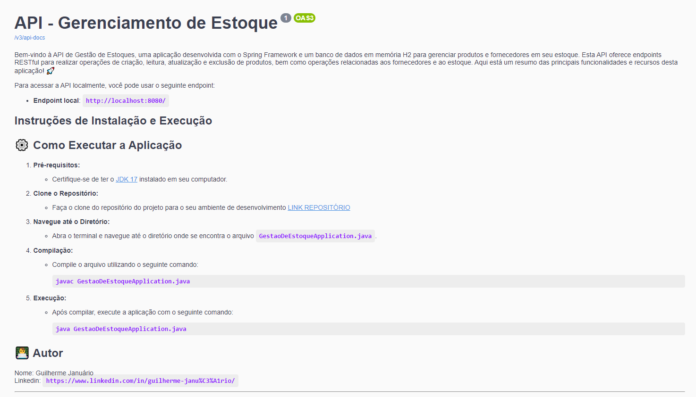
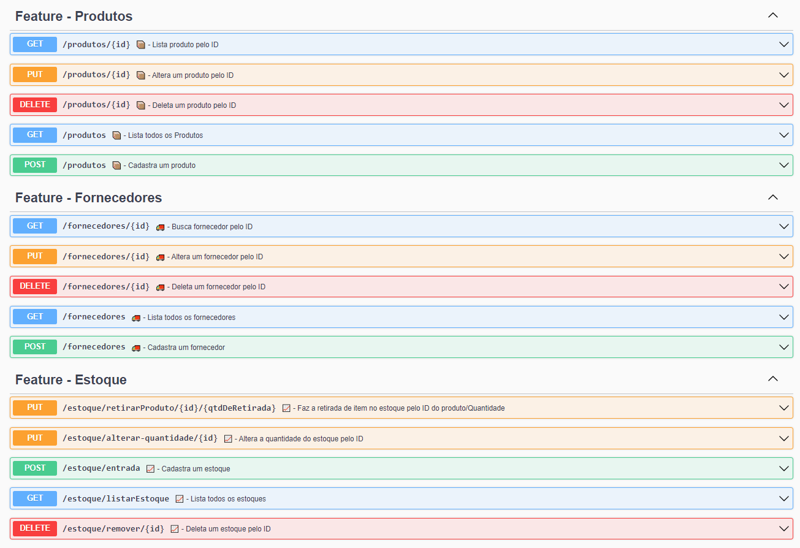

# API de Gestão de Estoques 📦

Bem-vindo à API de Gestão de Estoques, uma aplicação desenvolvida com o Spring Framework e um banco de dados em memória H2 para gerenciar produtos e fornecedores em seu estoque. Esta API oferece endpoints RESTful para realizar operações de criação, leitura, atualização e exclusão de produtos, bem como operações relacionadas aos fornecedores e ao estoque. Aqui está um resumo das principais funcionalidades e recursos desta aplicação! 🚀

## Funcionalidades Principais

## Endpoint Local

Para acessar a API localmente, você pode usar o seguinte endpoint:

- **Endpoint local**: `http://localhost:8080/`

### Fornecedores (Feature - Fornecedores) 🚚

- **Listar Todos os Fornecedores** (GET): `/fornecedores`
    - Lista todos os fornecedores cadastrados na base de dados.

- **Buscar Fornecedor por ID** (GET): `/fornecedores/{id}`
    - Busca um fornecedor específico pelo seu ID.

- **Cadastrar Fornecedor** (POST): `/fornecedores`
    - Cadastra um novo fornecedor no sistema com os seguintes dados:
      ```json
      {
        "nome": "Nome Fornecedor",
        "telefone": "(44) 99999-9999",
        "nro": "30",
        "cep": "04581-040"
      }
      ```
    - O sistema utiliza a API externa ViaCep para obter o endereço completo com base no CEP fornecido.

  **Retorno da Requisição:**
    ```json
    {
      "id": 1,
      "nome": "Nome Fornecedor",
      "telefone": "(44) 99999-9999",
      "cep": "04581-040",
      "nro": "30",
      "cepModel": {
        "id": 1,
        "cep": "04581-040",
        "logradouro": "Rua Doutor Afrânio Junqueira",
        "bairro": "Vila Cordeiro",
        "localidade": "São Paulo",
        "uf": "SP"
      }
    }
    ```
- **Alterar Dados do Fornecedor** (PUT): `/fornecedores/{id}`
    - Permite a atualização dos detalhes de um fornecedor existente.

- **Deletar Fornecedor** (DELETE): `/fornecedores/{id}`
    - Remove um fornecedor do sistema.

### Produtos (Feature - Produtos) 📦

- **Listar Todos os Produtos** (GET): `/produtos`
    - Lista todos os produtos cadastrados no sistema.

- **Buscar Produto por ID** (GET): `/produtos/{id}`
    - Busca um produto específico pelo seu ID.

- **Cadastrar Produto** (POST): `/produtos`
    - Cadastra um novo produto no sistema com os seguintes dados:
      ```json
      {
        "codigoBarras": "123984411",
        "marca": "Marca do Produto",
        "nome": "Nome do Produto",
        "descricao": "Descrição de venda do produto",
        "categoria": "Categoria do produto",
        "fornecedor": {
          "id": 1
        }
      }
      ```

### Estoque (Feature - Estoque) 📈

- **Listar Todos os Estoques** (GET): `/estoque/listarEstoque`
    - Lista todos os registros de estoque.

- **Cadastrar Entrada no Estoque** (POST): `/estoque/entrada`
    - Registra a entrada de produtos no estoque com o seguinte request:
      ```json
      {
        "produtoId": 1,
        "quantidade": 340,
        "valorCusto": 50.0,
        "valorVenda": 120.0,
        "lote": "Lote123",
        "validade": "2023-12-31"
      }
      ```

- **Remover Produto do Estoque** (DELETE): `/estoque/remover/{id}`
    - Remove um produto específico do estoque.

- **Alterar Quantidade no Estoque** (PUT): `/estoque/alterar-quantidade/{id}`
    - Realiza a retirada de produtos do estoque, informando a quantidade desejada. Também valida se a quantidade disponível é suficiente.

## Outras Características ✨

- **Swagger Documentation**: A API é documentada usando o Swagger, tornando-a fácil de entender para outros desenvolvedores. Acesse a documentação em `/swagger-ui.html`.

- **Registro de Log**: Todas as requisições feitas à API são registradas no banco de dados para consultas futuras, e os registros podem ser visualizados no console.

- **Docker Compose**: Utilizamos o Docker Compose para automatizar a execução da aplicação. Certifique-se de ter o Docker instalado e a imagem do Regis baixada. [Instruções de instalação do Docker e Regis serão fornecidas abaixo.]

- **Cache com Regis**: A aplicação utiliza o Regis para armazenar em cache as consultas repetidas aos mesmos endpoints, economizando recursos e acelerando as respostas, principalmente ao cadastrar fornecedores com consulta à API externa ViaCep.


## Instruções de Instalação e Execução

## ⚙️ Como Executar a Aplicação

1. **Pré-requisitos:**
    - Certifique-se de ter o [JDK 17](https://www.oracle.com/java/technologies/downloads/#java17) instalado em seu computador.

2. **Clone o Repositório:**
    - Faça o clone do repositório do projeto para o seu ambiente de desenvolvimento [LINK REPOSITÓRIO](https://github.com/guiijanuario/SistemaGestaoDeEstoque.git)

3. **Navegue até o Diretório:**
    - Abra o terminal e navegue até o diretório onde se encontra o arquivo `GestaoDeEstoqueApplication.java`.

4. **Compilação:**
    - Compile o arquivo utilizando o seguinte comando:
      ```
      javac GestaoDeEstoqueApplication.java
      ```

5. **Execução:**
    - Após compilar, execute a aplicação com o seguinte comando:
      ```
      java GestaoDeEstoqueApplication.java
      ```

6. **Acesso à Aplicação:**
    - Acesse a aplicação em execução em [http://localhost:8080/fornecedor](http://localhost:8080/fornecedor) no seu navegador.

---

### 📚 Documentação com Swagger

A documentação da API é gerada automaticamente pelo Swagger, facilitando a compreensão e teste das suas rotas. Siga os passos abaixo para acessar a documentação:

1. Certifique-se de que a aplicação esteja em execução.
2. Abra um navegador da web.
3. Acesse o seguinte link: [http://localhost:8080/swagger-ui/index.html#](http://localhost:8080/swagger-ui/index.html#).
4. Na página do Swagger, você verá uma lista de todas as operações disponíveis na sua API, incluindo os detalhes de entrada e saída para cada rota.
5. Clique em uma operação para abrir seus detalhes. Aqui, você pode testar a rota diretamente no navegador, fornecendo os parâmetros necessários e clicando em "Try it out!".

Certifique-se de que a aplicação esteja em execução para que o Swagger possa gerar a documentação corretamente. A documentação do Swagger é uma ferramenta valiosa para desenvolvedores e usuários da API, permitindo entender e testar facilmente as funcionalidades disponíveis.




---

## 🏢 Banco de Dados em Memória H2

A aplicação utiliza o banco de dados em memória H2 para armazenar os dados. Para acessar o console de administração do H2, siga os passos abaixo:

1. Acesse [http://localhost:8080/h2-console](http://localhost:8080/h2-console) no seu navegador.
2. No campo "JDBC URL", coloque `jdbc:h2:mem:dbGerenciamentoDeEstoque` (que é a URL de conexão com o banco de dados H2 em memória).
3. No campo "Username", insira `root`.
4. No campo "Password", insira `admin123`.
5. Clique em "Connect" para acessar o console de administração do H2.

Lembre-se de que o banco de dados em memória H2 é reiniciado sempre que a aplicação é reiniciada.

---

## 🧪 Utilização do Redis para Cache

A aplicação utiliza o Redis, um banco de dados em memória, para realizar o cache dos endereços obtidos pelo CEP. Para começar a usar o Redis em sua aplicação, siga os passos abaixo para criar uma instância do Redis usando o Docker:

1. **Instalar o Docker:**
   Certifique-se de ter o Docker instalado em seu sistema. Você pode baixar e instalar o Docker de acordo com o seu sistema operacional. As instruções estão disponíveis no site oficial do Docker: [https://docs.docker.com/get-docker/](https://docs.docker.com/get-docker/).

2. **Abra o Terminal:**
   Abra o terminal ou prompt de comando em seu sistema.

3. **Baixar e Iniciar o Container Redis:**
   Execute o seguinte comando para baixar e iniciar uma instância do Redis:

   ```bash
   docker run -d --name img-redis -p 6379:6379 redis


---

## 👨‍💻 Autor

Nome: Guilherme Januário<br>Linkedin: [Guilherme Januário](https://www.linkedin.com/in/guilherme-janu%C3%A1rio/)

---

<h4 align="center">©️ Feito com 💚 por <a href="https://github.com/guiijanuario">Guilherme Januário</a></h4>